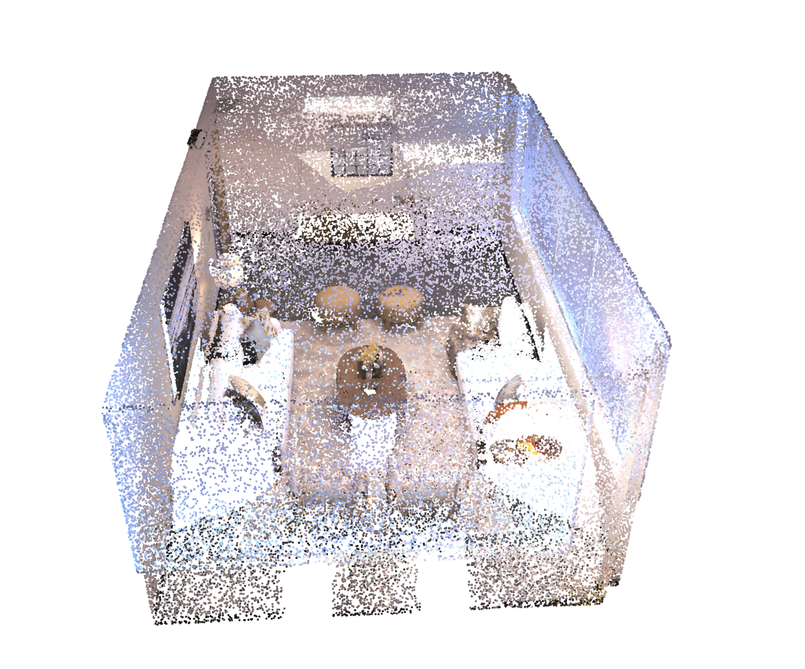

# test_task

# ход работы на текущий момент
# Попытка развернуть concept-graphs локально на машине
При попытке развернуть не получалось собрать пакет из репы https://github.com/krrish94/chamferdist, так как после последних коммитов есть проблемы в коде

Для решения проблемы был найден коммит с работающим кодом, который был вставлен в Dockerfile

В самом коде conect-graphs есть недочеты в возращаемых типах данных, которые были поправлены локально

Далее появились проблемы с версиями куды на локальной машине. Попытки настройки версий и драйверов nvidia не принесли никакого результата (Думаю если бы сидел дольше то получилось бы, но не факт, что это потом можно было возпроизвести на другой машине)

Чтобы максимизоровать шанс воспроизвдеения результатов запуска всего окружения было  принято решение создать Докер контейнер, в котором бы запускался (как минимум) baseline concept-graphs

На данный момент появилась проблема с прокидыванием девайсов (в контейнере не видно ни драйверов видекарты, ни самой видеокарты) в контейнер. 

Попытки решения проблемы:
1. Установка nvidia-container-toolkit с nvidia-docker2 и прокидыванием флага --gpus all при рантайме
2. Попытка выставления флагов окружения для прокидывания девайса в контейнер

Все попытки на данный момент безуспешны. Буду пытаться дальше

build

```bash
docker build  -t concept_graphs_baseline -f src/Dockerfile . --no-cache
```

To run and test env in container

with gpu (Doesn't work yet)
```bash
docker run --name baseline -v ./datasets/replica:/dataset/ -v ./datasets/llava-v1.5-7b:/models --gpus all concept_graphs_baseline:latest sleep infinity
```

without gpu
```bash
docker run --name baseline -v ./datasets/replica:/dataset/ -v ./datasets/llava-v1.5-7b:/models concept_graphs_baseline:latest sleep infinity
```

To stop container

```bash
docker stop baseline
```

# Результаты на текущий момент
Получилось локально запустить скрипт run_slam_rgb, но не более. 
Потому что для запуска conceptgraph/slam/cfslam_pipeline_batch.py нужно сгенерировать json файл для последующей работы (json генерируется скриптом [generate_gsa_results.py](concept-graphs%2Fconceptgraph%2Fscripts%2Fgenerate_gsa_results.py))
Сначала была проблема при генерации json'а - не хватало видеопамяти на видеокарте

Решением проблемы с памятью стало выключение графического интерфейса убунты через ctrl+f3 и остновка сервиса gdm, что позволило полностью очистить видео память. Но возникла новая проблема, во время исполнения не инициализируется cudnn (Надо поставить cudnn, но пока не успел сделать это правильно, так как есть проблемы при установке, которые пока не удалось решить, чтобы не было конфликтов между драйвером и компилятором куды)

В качестве экперимента попытался скачать и распаковать по скрипту от меты(фейсбука) датасет реплики, но файл поврежден 
ссылка: https://github.com/facebookresearch/Replica-Dataset/blob/main/download.sh (Скачивал, так как думал, что в текущем датасеты нехватает json, которые надо было сгенерировать)

```commandline
apartment_0/textures/23-color-ptex.hdr
apartment_0/textures/10-color-ptex.hdr
apartment_0/textures/5-color-ptex.hdr
apartment_0/textures/parameters.json
apartment_0/textures/19-color-ptex.hdr
apartment_0/textures/14-color-ptex.hdr
apartment_0/textures/21-color-ptex.hdr
apartment_0/textures/7-color-ptex.hdr
apartment_0/textures/30-color-ptex.hdr
apartment_0/textures/26-color-ptex.hdr
apartment_0/textures/28-color-ptex.hdr
apartment_0/textures/17-color-ptex.hdr
apartment_0/textures/2-color-ptex.hdr
unpigz: skipping: <stdin>: corrupted -- incomplete deflate data
unpigz: abort: internal threads error
tar: Unexpected EOF in archive
tar: Unexpected EOF in archive
tar: Error is not recoverable: exiting now
```

Результат работы run_slam_rgb представлен на рисунке ниже, отрисована сцена в `plotly`, сохранить само облако точек не получилось, так как убрали метод save_to_h5 во время разработки, и в документации не указали, как именно сохранять сцену.



Также в коде есть много неточностей в типах возвращаемых переменных. Но они обусловлены версией python (скорей всего). У меня на машине стоит python3.8 и в нем нельзя делать возвращаемый тип не из typing. Пример в коде def foo() -> tuple[int, float] в python3.8 выкинет ошибку, но def foo() -> Tuple[int, float] будет рабоать, если Tuple предварительно заимпортить из typing. Поэтому пришлось во многих функциях потправлять сигнатуры функций на входные параметры и возвращаемые значения.

При попытке запустить slam/cfslam_pipeline_batch.py код выкидывает ошибку, что не может найти, например, /gsa_classes_ram_withbg_allclasses.json в папке с датасетом реплика, но его там нет по определению, хотя в комментариях в коде написано, что они там должны быть, если правильно подготовить датасет, но где именно 

### P.s. Отдельный ад с кудой. 
При попытке все засунуть в докер оказалось, чтобы окружение работало с видеокартой в контейнере на хостовой машине должна стоять та же версия куды, а также компилятора(CudNN) для того, чтобы все заработало

После 8-10 попыток поставить все на хост машину и запустить в контейнере было принято решение сделать так, чтобы код запустился хотябы на хостовой машине. В итоге получилось поставить нужную версию с помощью .run файла предварительно удалив все драйвера и все, что связано с nvidia с машины несколько раз.


